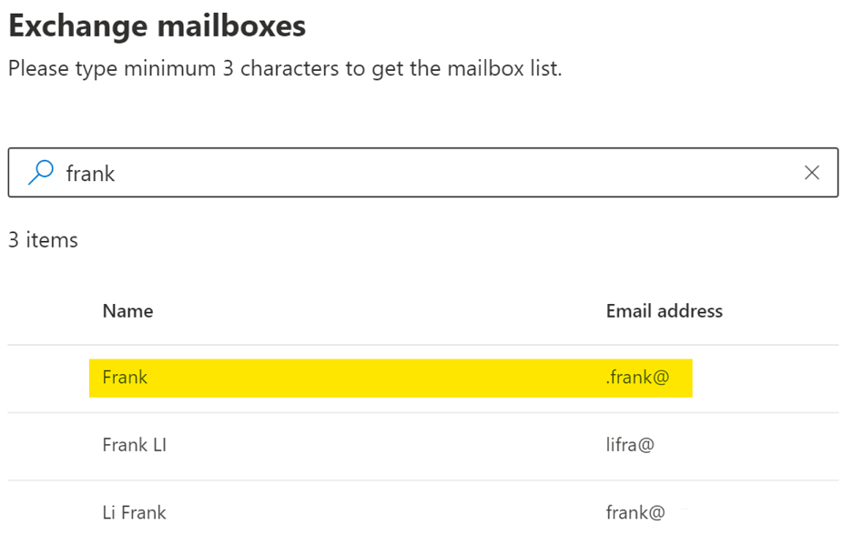

# Restore large soft-deleted / inactive mailbox
## Introduction
Restoring a soft-deleted / inactive mailbox can be done through the `New-MailboxRestoreRequest` PowerShell cmdlet. This typically works for the primary mailbox (steps [here](https://docs.microsoft.com/en-us/exchange/recipients-in-exchange-online/delete-or-restore-mailboxes#restoring-a-user-in-a-hybrid-deployment)).

As for an archive mailbox with auto-expanding enabled, you may stumble into the following error message.
> Unable to perform Mailbox Restore as one of the mailboxes is a Large Archive. You can use eDiscovery to search and export data that has been preserved in inactive mailboxes.

Unfortunately, even though this is mentioned in the [documentation](https://docs.microsoft.com/en-us/microsoft-365/compliance/restore-an-inactive-mailbox?view=o365-worldwide):
> You can't recover or restore an inactive mailbox that's configured with an auto-expanding archive. If you need to recover data from an inactive mailbox with an auto-expanding archive, use content search to export the data from the mailbox and then import to another mailbox.

The exact steps are not documented.

You can restore a soft-deleted / inactive mailbox using Content search by selecting the mailbox with a leading "." (for example *.kevin@contoso.com*).




In this guide, we use PowerShell to create the content search job.

## Procedure
To create a content search job on the soft-deleted / inactive archive. 

1. [Connect to Security & Compliance Center PowerShell](https://docs.microsoft.com/en-us/powershell/exchange/connect-to-scc-powershell?view=exchange-ps).

2. Run the following cmdlet to create the content search.
```
New-ComplianceSearch -Name "ContentSearch-InactiveMailbox" -ExchangeLocation .kevin@contoso.com -AllowNotFoundExchangeLocationsEnabled $true
```
Please note that there is a leading `.` before the email address of the soft-deleted / inactive mailbox.
Additionally, the cmdlet documentation mentions that "*you also need to include the AllowNotFoundExchangeLocationsEnabled parameter so the search doesn't try to validate the existence of the inactive mailbox*".


3. Start the compliance search.
```
Start-ComplianceSearch -Identity "ContentSearch-InactiveMailbox"
```

You can track the progress of the compliance search with
```
Get-ComplianceSearch -Identity "ContentSearch-InactiveMailbox"
```

Finally, once the content search is ready, you can manually navigate to your Microsoft 365 Security & Compliance center to check the created content search and proceed with the results export.

### Contribution
Kudos for Marcus Nguyen, Solutions Architect from ISOutsource, for having been with us through this and ultimately inspired us to write this guide.

## More information
[Delete or restore user mailboxes in Exchange Online | Microsoft Docs](https://docs.microsoft.com/en-us/exchange/recipients-in-exchange-online/delete-or-restore-mailboxes#restoring-a-user-in-a-hybrid-deployment)

[New-ComplianceSearch (Exchange PowerShell) | Microsoft Docs](https://docs.microsoft.com/en-us/powershell/module/exchange/new-compliancesearch?view=exchange-ps)

[Start-ComplianceSearch (Exchange PowerShell) | Microsoft Docs](https://docs.microsoft.com/en-us/powershell/module/exchange/start-compliancesearch?view=exchange-ps)

[Get-ComplianceSearch (Exchange PowerShell) | Microsoft Docs](https://docs.microsoft.com/en-us/powershell/module/exchange/get-compliancesearch?view=exchange-ps)